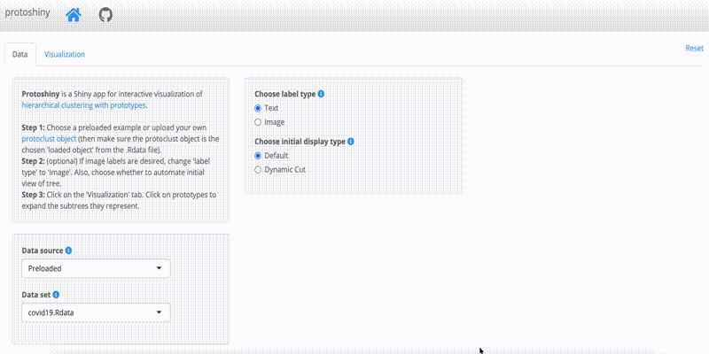

<!-- README.md is generated from README.Rmd. Please edit that file -->

```{r, include = FALSE}
knitr::opts_chunk$set(
  collapse = TRUE,
  comment = "#>",
  fig.path = "man/figures/README-",
  out.width = "100%"
)
```

# protoshiny

<!-- badges: start -->
[](https://app.travis-ci.com/andeek/protoshiny.svg?branch=master)
<!-- badges: end -->

This package launches a Shiny app to interactively visualize hierarchical clustering with prototypes.

For details on hierarchical clustering with prototypes, see see "Hierarchical Clustering With Prototypes via Minimax Linkage" by Jacob Bien & Robert Tibshirani (2011).

## Installation

You can install the development version from [GitHub](https://github.com/) with:

``` r
# install.packages("devtools")
devtools::install_github("andeek/protoshiny")
```
## Launching the app

``` r
# launch the app
library(protoshiny)
visualize_hc()
```

## Using the app

<!-- ffmpeg -i default_data.mov -s 800x400 -pix_fmt rgb24 -r 10 -f gif - | gifsicle --optimize=3 --delay=3 > ~/Documents/research/data_viz/protoshiny/man/figures/README-default_data.gif -->

After launching the application, either upload your own cluster object or use the provided demo data sets. To use the provided demo data sets, simply select one from the dropdown. To quickly get to interacting with the dendrogram, you can leave all other options as the default and click the "Visualization" tab.


<!-- TODO: remake to choose movies and click visualization tab. -->


If you would like to upload your own data set hierarchical clustering object, select its location on your computer.


Once you have chosen the data set clustering to visualize, you can specify more options in the application. To specify image labels for each prototype in the dendrogram, select their location on your computer.


If you would like your initial view of the dendrogram to be a dynamic cut (provided by the `dynamicTreeCut` package), you can choose the minimum size of the final clusters resulting from the cut.


Once all of the options are chosen, click the "Visualization" tab to interact with the dendrogram.


Your abilities to interact with the dendrogram include expanding/contracting clusters,


zooming and panning,


and searching for the first instance of a label.


