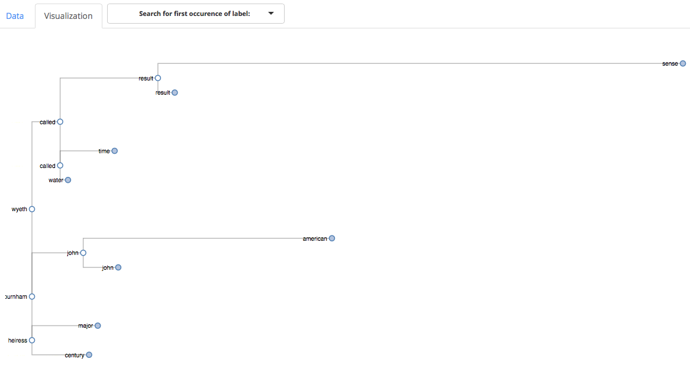

# protoshiny
Shiny app to interactively visualize hierarchical clustering with prototypes.

For details on hierarchical clustering with prototypes, see http://faculty.bscb.cornell.edu/~bien/papers/jasa2011minimax.pdf  

# Contents

This repo contains the application in the [application folder](application/) as well as a working paper in the [paper folder](paper/).

# Installation

1. Install the `shinythemes` package with `install.packages("shinythemes")`.
2. Clone this repo.

# Using the app

After cloning the repo, use the command `shiny::runApp("application/")` to launch the shiny application. From here, either upload your own cluster object or use the provided demo datasets. Click the `Visualization` tab to interact with the dendrogram.

